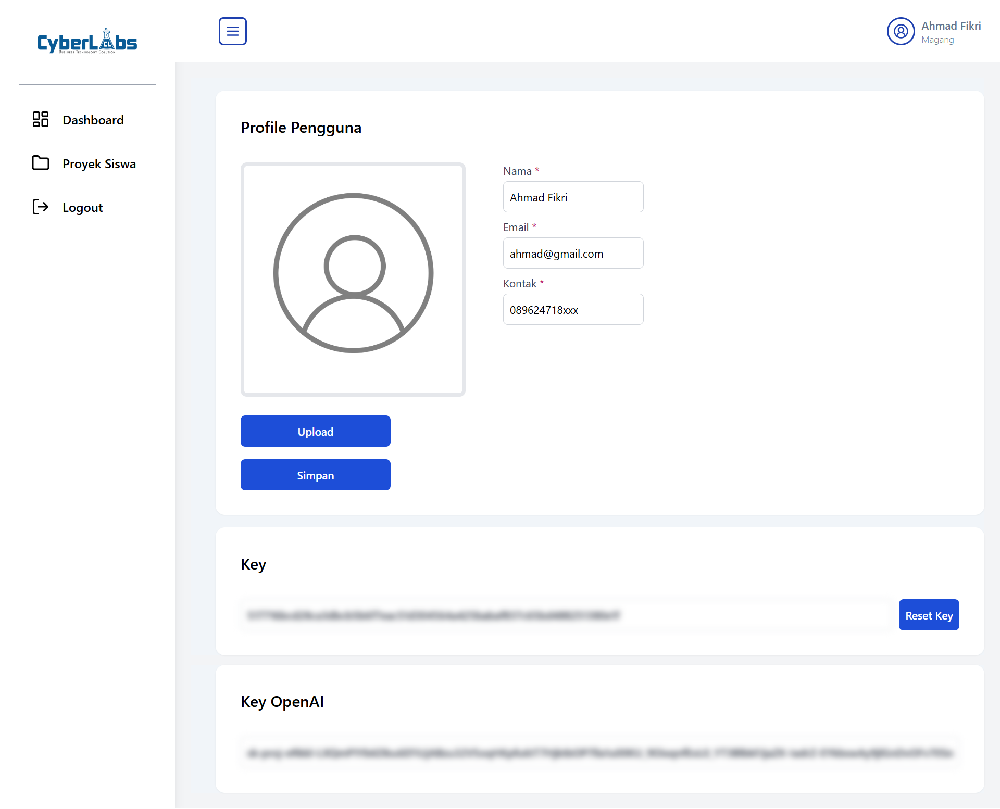
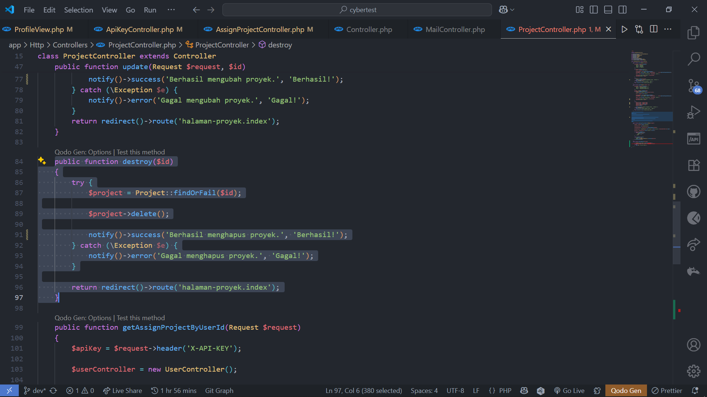
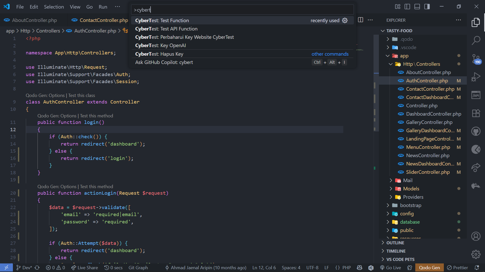

# 🚀 CyberTest: Auto Unit Test

**CyberTest** adalah ekstensi Visual Studio Code yang dikembangkan dalam rangka penelitian di perusahaan **Cyberlabs**. Ekstensi ini dirancang untuk membantu proses **pengujian unit test secara otomatis** dan memberikan **penilaian kode program** secara cepat dan efisien, khususnya untuk para peserta magang.

---

## ✨ Fitur Utama

- ✅ Mendukung pengujian otomatis untuk **kode Laravel** dan **Dart (Flutter)**
- 📊 Memberikan **penilaian kode program**
- 📋 Menampilkan **laporan hasil unit test secara otomatis**

---

## 🛠️ Instalasi

Ekstensi **Auto Unit Test** tersedia di **Visual Studio Code Marketplace**.

### Cara Instalasi:
1. Buka **Extensions** di VS Code (`Ctrl + Shift + X`)
2. Cari: `Auto Unit Test`
3. Klik **Install**

---

## ⚙️ Cara Pengguaan

### 1. 🔑 Instalasi API Key OpenAI & Website CyberTest

Gunakan API key yang tersedia di halaman profil Anda pada **Website CyberTest**.

📸 **Contoh Halaman Profil:**

---

### 2. 🧪 Otomatisasi Unit Test

Lakukan seleksi pada bagian kode yang ingin diuji secara otomatis.

📸 **Contoh Seleksi Kode:**

---

### 3. ▶️ Menjalankan Ekstensi

Tekan `Ctrl + Shift + P`, lalu ketik dan pilih fitur yang ingin dijalankan dari ekstensi.

📸 **Contoh Menu Ekstensi:**

---

## 📣 Catatan

Ekstensi ini hanya bisa digunakan jika Anda terdaftar sebagai peserta magang di perusahaan Cyberlabs

---

## 🤝 Kontribusi

Kami terbuka untuk kontribusi dari komunitas. Silakan ajukan pull request atau laporkan masalah melalui **GitHub Issues**.

---

## 📬 Kontak

Jika Anda memiliki pertanyaan atau saran, silakan hubungi:

- 📧 Email: ahmadjaenal629@gmail.com
- 🌐 Github: https://github.com/AhmadJaenal
